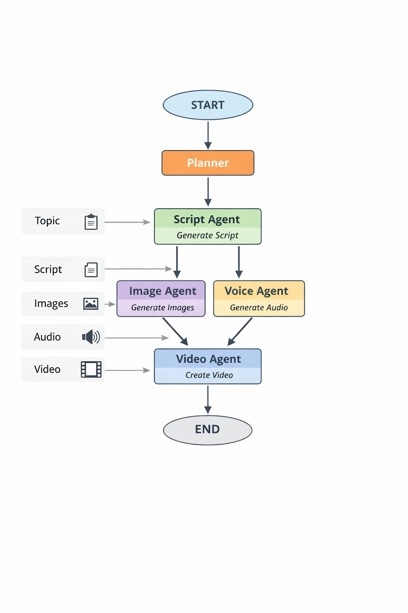

# 一、项目目标

做一个 **AI Content Agent**：

用户输入：

```
做一个关于熊猫的短视频
```

系统自动：

```
Planner
 ↓
生成脚本
 ↓
生成图片
 ↓
生成旁白
 ↓
合成视频
```

最终输出：

```
video.mp4
```

核心目的是 **掌握 Agent Planner + Workflow**。

---

# 二、项目技术栈（推荐）

### 1 AI 框架

Agent Workflow：

- LangGraph(LangChain)

LLM：

- qwen（apiKey 见 `.env`）

---

### 2 编程语言

```
TypeScript
```

---

### 3 图片生成

使用阿里云百炼中的图片生成模型。

---

### 4 语音生成

使用阿里云百炼中的语音生成模型。

---

### 5 视频生成

使用阿里云百炼中的视频生成模型。

---

### 6 视频合成

- Remotion

---

### 7 数据存储

简单版本：

```
JSON
```

---

# 三、项目架构（核心）

这是 **AI Agent Workflow 架构**：

```
User
 ↓
Planner
 ↓
Task List
 ↓
Executor
 ↓
Tools
```

具体节点：

```
Planner
 ↓
Script Agent
 ↓
Image Agent
 ↓
Voice Agent
 ↓
Video Agent
```



---

# 四、LangGraph Workflow

Graph 结构：

```
START
 ↓
planner
 ↓
script_agent
 ↓
image_agent
 ↓
voice_agent
 ↓
video_agent
 ↓
END
```

---

# 五、项目目录结构（后端）

> 只列举重要的部分。

```
ai-video-agent
│
├── src
│
├── agents
│   ├── planner.ts
│   ├── scriptAgent.ts
│   ├── imageAgent.ts
│   ├── voiceAgent.ts
│   └── videoAgent.ts
│
├── tools
│   ├── imageTool.ts
│   ├── voiceTool.ts
│   └── videoTool.ts
│
├── workflow
│   └── graph.ts
│
├── prompts
│   ├── plannerPrompt.ts
│   └── scriptPrompt.ts
│
├── types
│   └── state.ts
│
└── index.ts
```

> 前端（web文件夹）使用 React19 + antdesign pro（架构和样式自行发挥）。

---

# 六、State 设计

State 是 **整个 Agent 系统的共享数据**。

```
type AgentState = {
  topic: string
  script: string
  images: string[]
  audio: string
  video: string
}
```

数据流：

```
topic
 ↓
script
 ↓
images
 ↓
audio
 ↓
video
```

---

# 七、Planner 设计

Planner 只负责：

```
任务拆解
```

Prompt：

```
You are an AI planner.

Break the user task into steps for creating a short video.
```

返回：

```
1 write script
2 generate images
3 generate narration
4 compose video
```

---

# 八、Executor

Executor 的任务：

```
按顺序执行 agent
```

例如：

```
script_agent → image_agent → voice_agent
```

---

# 九、Agent 职责

### Script Agent

输入：

```
topic
```

输出：

```
script
```

---

### Image Agent

输入：

```
script
```

输出：

```
images
```

---

### Voice Agent

输入：

```
script
```

输出：

```
audio
```

---

### Video Agent

输入：

```
images + audio
```

输出：

```
video.mp4
```

---

# 十、项目开发路线

我给你拆成 **5 个小阶段**。

---

## Phase 1

先实现 **最简单 workflow**

```
User
 ↓
script_agent
 ↓
END
```

输入：

```
熊猫
```

输出：

```
script.txt
```

---

## Phase 2

加入：

```
image_agent
```

流程：

```
topic
 ↓
script
 ↓
images
```

---

## Phase 3

加入：

```
voice_agent
```

流程：

```
topic
 ↓
script
 ↓
audio
```

---

## Phase 4

加入：

```
video_agent
```

生成：

```
video.mp4
```

---

## Phase 5

最后加入：

```
planner
```

完整系统：

```
User
 ↓
Planner
 ↓
Workflow
 ↓
Video
```
